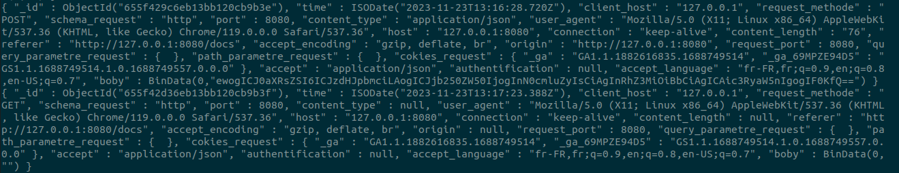

# CollectMiddleware

[](https://fastapi.tiangolo.com/)
[](https://www.mongodb.com/)
[](#)
[](https://www.docker.com/)
[](LICENSE)
[]()

The objective of this project is to develop a middleware that can efficiently transmit the data gathered from an Object Request to a MongoDB Database. The middleware will play a crucial role in the overall process of collecting and analyzing data. It will act as a bridge between the Object Request and the database, ensuring that the data is transmitted accurately and securely. Once the data is collected in the database, it can be further analyzed and used to gain valuable insights that can help in making informed decisions. In short, the middleware will enable seamless and efficient data transmission, making the process of data analysis more effective and reliable.

# how to install

``` bash
pip3 install collectmiddleware
```

# How to use it

``` python

from fastapi import FastAPI
from collectmiddleware import CollectMiddleware

app = FastAPI()

app.add_middleware(CollectMiddleware, mongodb_uri="mongodb://localhost:27017/")


@app.get("/")
async def main():
    return {"message": "Hello World"}
```

## Example


